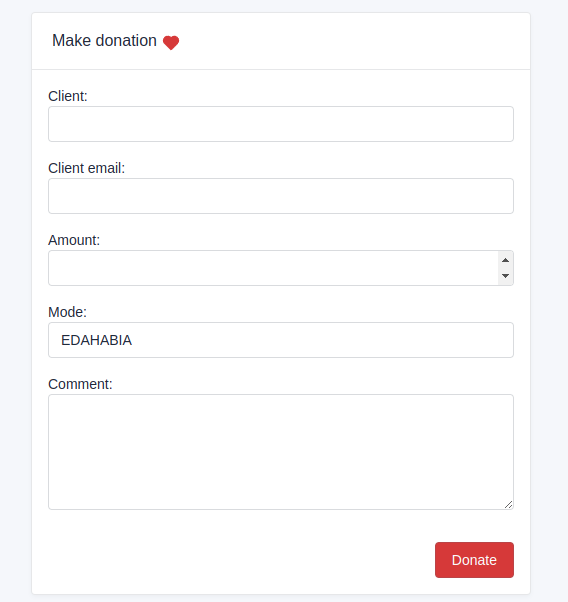
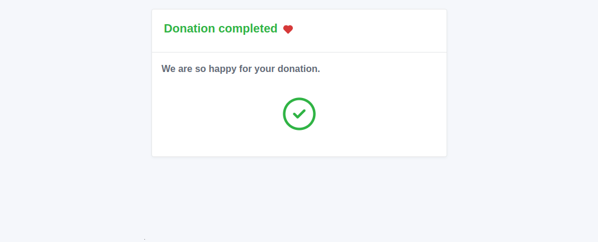
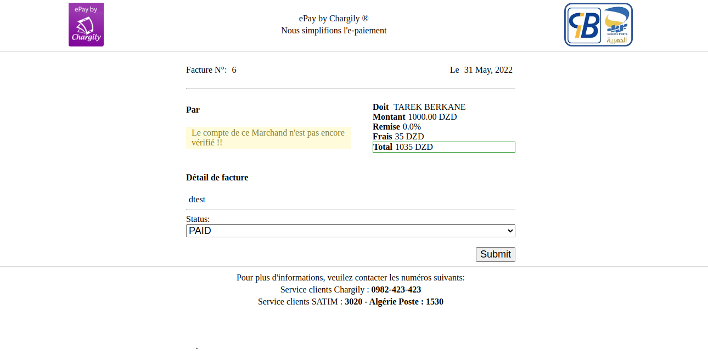

# epay-gateway-django
Chargily ePay Gateway (Django Package)


This Plugin is to integrate ePayment gateway with Chargily easily.
- Currently support payment by **CIB / EDAHABIA** cards and soon by **Visa / Mastercard** 
- This repo is recently created for **Django plugin**, If you are a developer and want to collaborate to the development of this plugin, you are welcomed!

# Installation
```py
pip install chargily-epay-django
```

## Create Payment model 
to create a payment model you need to extend one of the following classes `AbstractPayment`, `AnonymPayment`, `AnonymPayment`.

```py 
from chargily_epay_django.models import AnonymPayment

class Payment(AnonymPayment):
    webhook_url = 'payment-confirmation' # reverse url
    back_url = 'payment-status' # reverse url
```

## CreatePaymentView
you can create a new Payment using `CreatePaymentView`, this class extends from `CreateView` 

```py
# views.py
from django.forms import ModelForm

from chargily_epay_django.views import CreatePaymentView

from my_app.models import Payment

class PaymentForm(ModelForm):
    class Meta:
        model = Payment
        fields = ['client', 'client_email', 'amount', 'mode', 'comment']

class CreatePayment(CreatePaymentView):
    template_name: str = "payment/payment-template.html"
    form_class = PaymentForm
```

#### Example


## PaymentConfirmationView
if you want to confirme payment you can use `PaymentConfirmationView` view, this view responsable for reciving payment confirmation from third party.

```py
# views.py
# .....
from chargily_epay_django.views import CreatePaymentView, PaymentConfirmationView

# .....

class PaymentConfirmation(PaymentConfirmationView):
    model = Payment
```
## PaymentObjectStatusView, Or PaymentObjectDoneView
to check payment status you can use `PaymentObjectStatusView`, Or `PaymentObjectDoneView` check the doc to see dirence

```py
# views.py
# .....
from chargily_epay_django.views import CreatePaymentView, PaymentConfirmationView, PaymentObjectDoneView
# .....

class PaymentStatus(PaymentObjectDoneView):
    template_name: str = "payment/payment-status.html"
    model = Payment
```


#### Example



### FakePayment
if you are working in `Devlopment` mode you can use `FakePaymentView` all you need to do is to create a view and extend this class and add `FakePaymentMixin`  , to `Payment` model

```py
# models.py

from chargily_epay_django.models import AnonymPayment, FakePaymentMixin

class Payment(FakePaymentMixin,AnonymPayment):
    webhook_url = 'payment-confirmation' # reverse url
    back_url = 'payment-status' # reverse url
    fake_payment_url = "fake-payment" # reverse url
```

```py
# view 
from chargily_epay_django.views import (
    CreatePaymentView,
    PaymentConfirmationView,
    PaymentObjectDoneView,
    FakePaymentView
)

class FakePayment(FakePaymentView):
    model = Payment
```

#### Example 



## Result
we now can **CREATE**, **UPDATE** and **READ** payment using this few lines of code.

**Note**: you still have to configure settings, and urls.py

```py 
# models.py

from chargily_epay_django.models import AnonymPayment, FakePaymentMixin

class Payment(FakePaymentMixin,AnonymPayment):
    webhook_url = 'payment-confirmation' # reverse url
    back_url = 'payment-status' # reverse url
    fake_payment_url = "fake-payment" # reverse url
```

```py
# views.py

from django.forms import ModelForm

from chargily_epay_django.views import (
    CreatePaymentView,
    PaymentConfirmationView,
    PaymentObjectDoneView,
    FakePaymentView

)

from my_app.models import Payment

# FORM
class PaymentForm(ModelForm):
    class Meta:
        model = Payment
        fields = ['client', 'client_email', 'amount', 'mode', 'comment']

# VIEWS
class CreatePayment(CreatePaymentView):
    template_name: str = "payment/payment-template.html"
    form_class = PaymentForm


class PaymentConfirmation(PaymentConfirmationView):
    model = Payment


class PaymentStatus(PaymentObjectDoneView):
    template_name: str = "payment/payment-status.html"
    model = Payment

class FakePayment(FakePaymentView):
    model = Payment
```


# Contribution tips
1. Make a fork of this repo.
2. Take a tour to our [API documentation here](https://dev.chargily.com/docs/#/epay_integration_via_api)
3. Get your API Key/Secret from [ePay by Chargily](https://epay.chargily.com.dz) dashboard for free.
4. Start developing.
5. Finished? Push and merge.
